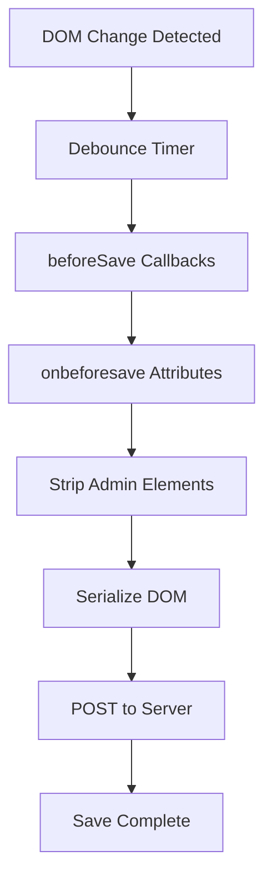

# Save Lifecycle Deep Dive

Understanding Hyperclay's save lifecycle is crucial for building robust applications. This guide explores how saves work, when they trigger, and how to control the process with `onbeforesave` patterns.

## The Save Lifecycle Overview



## When Saves Trigger

### Automatic Triggers

1. **DOM Mutations** - Any change to the DOM structure
2. **Attribute Changes** - When attributes are modified
3. **Text Content Changes** - Including contenteditable updates
4. **Form Value Changes** - For inputs with `persist` attribute

### Manual Triggers

1. **Keyboard Shortcut** - Cmd/Ctrl+S
2. **Trigger Button** - Elements with `trigger-save` attribute
3. **Programmatic** - Calling `hyperclay.savePage()`

### What Doesn't Trigger Saves

- Changes to elements with `mutations-ignore` attribute
- Changes to elements with `save-ignore` attribute
- Transient UI states (hover, focus, etc.)
- CSS-only changes without DOM updates

## The onbeforesave Attribute

The `onbeforesave` attribute executes JavaScript before the page is saved, allowing you to clean up or transform the DOM.

### Basic Usage

```html
<!-- Remove temporary UI before saving -->
<div class="temp-notification" onbeforesave="this.remove()">
    This message won't be saved
</div>

<!-- Reset form values -->
<form onbeforesave="this.reset()">
    <input type="text" value="Temporary value">
</form>

<!-- Clean up attributes -->
<div class="modal" open onbeforesave="this.removeAttribute('open')">
    Modal content
</div>
```

### Advanced Patterns

#### 1. Conditional Cleanup

```html
<div class="draft-content" 
     onbeforesave="if (this.dataset.status === 'draft') this.remove()">
    Draft content that only saves when published
</div>

<script>
function publishDraft(element) {
    element.dataset.status = 'published';
    hyperclay.savePage(() => {
        toast('Draft published!');
    });
}
</script>
```

#### 2. Data Transformation

```html
<!-- Sort items before saving -->
<ul class="item-list" onbeforesave="sortChildren(this)">
    <li data-priority="3">Low priority</li>
    <li data-priority="1">High priority</li>
    <li data-priority="2">Medium priority</li>
</ul>

<script>
function sortChildren(container) {
    const items = Array.from(container.children);
    items.sort((a, b) => 
        parseInt(a.dataset.priority) - parseInt(b.dataset.priority)
    );
    items.forEach(item => container.appendChild(item));
}
</script>
```

#### 3. State Preservation

```html
<!-- Save scroll position -->
<div class="scrollable-content" 
     onbeforesave="this.dataset.scrollTop = this.scrollTop"
     onrender="this.scrollTop = this.dataset.scrollTop || 0">
    Long content...
</div>

<!-- Save tab state -->
<div class="tabs" onbeforesave="saveTabState(this)">
    <button class="tab active">Tab 1</button>
    <button class="tab">Tab 2</button>
</div>

<script>
function saveTabState(tabContainer) {
    const activeTab = tabContainer.querySelector('.tab.active');
    tabContainer.dataset.activeTab = 
        Array.from(tabContainer.children).indexOf(activeTab);
}
</script>
```

## Global beforeSave Hook

For application-wide save transformations, use the global `hyperclay.beforeSave` hook:

```javascript
hyperclay.beforeSave = function(doc) {
    // Remove all temporary elements
    doc.querySelectorAll('[data-temp]').forEach(el => el.remove());
    
    // Clean up empty containers
    doc.querySelectorAll('.container').forEach(container => {
        if (container.children.length === 0) {
            container.remove();
        }
    });
    
    // Normalize whitespace
    doc.querySelectorAll('p, h1, h2, h3').forEach(el => {
        el.textContent = el.textContent.trim();
    });
    
    // Add save timestamp
    const meta = doc.querySelector('meta[name="last-saved"]') || 
                 doc.createElement('meta');
    meta.name = 'last-saved';
    meta.content = new Date().toISOString();
    if (!meta.parentElement) {
        doc.head.appendChild(meta);
    }
};
```

## Save Patterns and Best Practices

### 1. Progressive Enhancement Pattern

Start with a clean, static version and enhance for editing:

```html
<!-- Base content (saved version) -->
<article class="post">
    <h2>Blog Post Title</h2>
    <p>This is the content that gets saved...</p>
</article>

<!-- Enhancement script -->
<script>
document.addEventListener('DOMContentLoaded', () => {
    if (hyperclay.isEditMode()) {
        // Add edit UI
        document.querySelectorAll('.post').forEach(post => {
            const toolbar = document.createElement('div');
            toolbar.className = 'edit-toolbar';
            toolbar.innerHTML = `
                <button onclick="editPost(this)">Edit</button>
                <button onclick="deletePost(this)">Delete</button>
            `;
            toolbar.setAttribute('onbeforesave', 'this.remove()');
            post.insertBefore(toolbar, post.firstChild);
        });
    }
});
</script>
```

### 2. Form State Management

Handle form states intelligently:

```html
<form class="user-form" onbeforesave="cleanFormState(this)">
    <input type="text" name="username" persist>
    <input type="password" name="password">
    <div class="error-message" onbeforesave="this.remove()"></div>
    <div class="success-message" onbeforesave="this.remove()"></div>
</form>

<script>
function cleanFormState(form) {
    // Clear sensitive data
    form.querySelectorAll('input[type="password"]').forEach(input => {
        input.value = '';
    });
    
    // Remove temporary classes
    form.classList.remove('submitting', 'error', 'success');
    
    // Clear validation states
    form.querySelectorAll('.invalid').forEach(el => {
        el.classList.remove('invalid');
    });
}
</script>
```

### 3. Modal and Overlay Management

Ensure modals don't save in open state:

```html
<div class="modal" id="settings-modal" 
     onbeforesave="this.classList.remove('open'); this.style.display = ''">
    <div class="modal-content">
        <h3>Settings</h3>
        <!-- Modal content -->
    </div>
</div>

<style>
.modal { display: none; }
.modal.open { display: flex; }
</style>
```

### 4. Dynamic Content Cleanup

Remove dynamically generated content:

```html
<div class="search-results" onbeforesave="this.innerHTML = ''">
    <!-- Results populated via JavaScript -->
</div>

<div class="live-preview" onbeforesave="resetToPlaceholder(this)">
    <!-- Preview content -->
</div>

<script>
function resetToPlaceholder(element) {
    element.innerHTML = '<p class="placeholder">Preview will appear here</p>';
}
</script>
```

## Complex Save Scenarios

### 1. Collaborative Editing

Manage multiple users' temporary states:

```javascript
// Track user's unsaved changes
const userChanges = new Map();

hyperclay.beforeSave = function(doc) {
    // Save only confirmed changes
    userChanges.forEach((changes, elementId) => {
        if (changes.confirmed) {
            const element = doc.getElementById(elementId);
            if (element) {
                Object.assign(element.dataset, changes.data);
            }
        }
    });
    
    // Clear temporary editing indicators
    doc.querySelectorAll('[data-editing-user]').forEach(el => {
        delete el.dataset.editingUser;
    });
};
```

### 2. Version Control

Implement simple version tracking:

```html
<div class="content-block" 
     data-version="1"
     onbeforesave="incrementVersion(this)">
    <p edit-mode-contenteditable>Versioned content</p>
</div>

<script>
function incrementVersion(element) {
    // Only increment if content actually changed
    const currentContent = element.querySelector('p').textContent;
    const lastContent = element.dataset.lastContent;
    
    if (currentContent !== lastContent) {
        element.dataset.version = parseInt(element.dataset.version) + 1;
        element.dataset.lastContent = currentContent;
        element.dataset.lastModified = new Date().toISOString();
    }
}
</script>
```

### 3. Conditional Saving

Save different states based on conditions:

```javascript
hyperclay.beforeSave = function(doc) {
    const isDraft = doc.body.dataset.documentStatus === 'draft';
    
    if (isDraft) {
        // Save minimal draft state
        doc.querySelectorAll('[data-draft-only="false"]').forEach(el => {
            el.remove();
        });
    } else {
        // Save full published state
        doc.querySelectorAll('[data-draft-only="true"]').forEach(el => {
            el.remove();
        });
    }
};
```

## Performance Optimization

### 1. Debouncing Saves

Control save frequency:

```javascript
// Custom save debouncing
let saveTimeout;
const customSave = () => {
    clearTimeout(saveTimeout);
    saveTimeout = setTimeout(() => {
        hyperclay.savePage(() => {
            console.log('Saved after custom debounce');
        });
    }, 2000); // 2 second debounce
};

// Use for expensive operations
document.querySelector('#expensive-slider').addEventListener('input', customSave);
```

### 2. Batch Operations

Group multiple changes:

```html
<div class="batch-container" onbeforesave="processBatchChanges(this)">
    <!-- Multiple items -->
</div>

<script>
function processBatchChanges(container) {
    // Collect all changes
    const changes = [];
    container.querySelectorAll('[data-changed="true"]').forEach(el => {
        changes.push({
            id: el.id,
            value: el.textContent
        });
        el.removeAttribute('data-changed');
    });
    
    // Store batch for processing
    if (changes.length > 0) {
        container.dataset.pendingChanges = JSON.stringify(changes);
    }
}
</script>
```

### 3. Selective DOM Cleaning

Target specific areas for cleanup:

```javascript
hyperclay.beforeSave = function(doc) {
    // Only clean specific sections
    const cleanupZones = doc.querySelectorAll('[data-cleanup-zone]');
    
    cleanupZones.forEach(zone => {
        const cleanupType = zone.dataset.cleanupZone;
        
        switch(cleanupType) {
            case 'comments':
                zone.querySelectorAll('.temp-comment').forEach(c => c.remove());
                break;
            case 'previews':
                zone.querySelectorAll('.preview').forEach(p => {
                    p.innerHTML = '';
                });
                break;
        }
    });
};
```

## Debugging Save Issues

### 1. Save Inspection

Monitor what gets saved:

```javascript
// Debug mode
const debugSave = hyperclay.beforeSave;
hyperclay.beforeSave = function(doc) {
    console.group('Save Lifecycle Debug');
    console.log('Pre-save DOM:', doc.cloneNode(true));
    
    // Run original beforeSave
    if (debugSave) debugSave(doc);
    
    console.log('Post-save DOM:', doc.cloneNode(true));
    console.groupEnd();
};
```

### 2. Save Validation

Ensure save integrity:

```javascript
hyperclay.beforeSave = function(doc) {
    // Validate before saving
    const errors = [];
    
    // Check for required elements
    if (!doc.querySelector('h1')) {
        errors.push('Missing page title');
    }
    
    // Check for broken states
    doc.querySelectorAll('[data-required]').forEach(el => {
        if (!el.textContent.trim()) {
            errors.push(`Empty required field: ${el.dataset.required}`);
        }
    });
    
    if (errors.length > 0) {
        console.error('Save validation errors:', errors);
        toast('Cannot save: ' + errors.join(', '), 'error');
        throw new Error('Save validation failed');
    }
};
```

## Best Practices Summary

1. **Clean Up Temporary UI** - Remove admin controls, error messages, and temporary states
2. **Preserve User Data** - Keep form values and content, remove only UI chrome
3. **Use onbeforesave Wisely** - Put cleanup logic close to the elements it affects
4. **Test Both States** - Always verify how your app looks in both edit and view modes
5. **Handle Edge Cases** - Consider what happens with empty states, errors, and loading states
6. **Document Save Behavior** - Comment complex save transformations for future reference

The save lifecycle is the heart of Hyperclay's magic. Master it, and you'll build apps that seamlessly blend editing and viewing experiences!